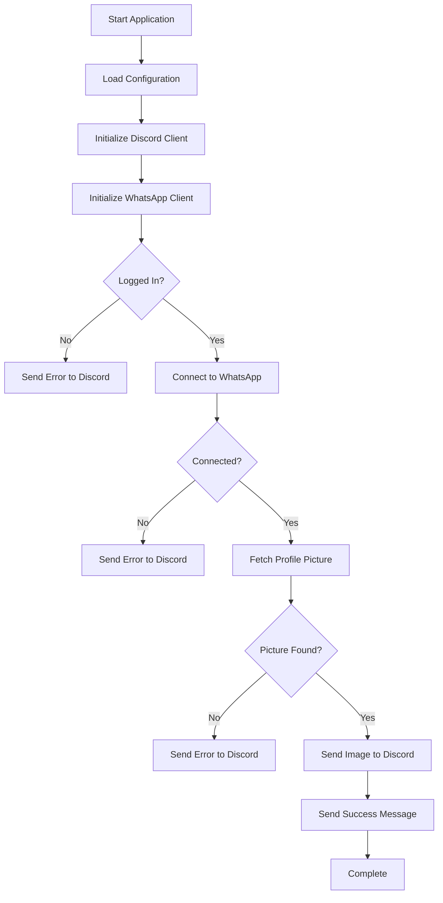

# WhatsApp Profile Fetcher

A Go application that fetches WhatsApp profile images and sends them to Discord via webhook. Designed to run as a scheduled job on Google Cloud Run.

## Features

- 🔐 **Secure Authentication**: Pre-paired session management for reliable authentication
- 📸 **Profile Image Fetching**: Downloads profile pictures from WhatsApp
- 🎯 **Discord Integration**: Sends images and notifications to Discord via webhook
- 📱 **Multiple Pairing Methods**: QR code or phone number pairing
- 🐳 **Docker Ready**: Containerized for easy deployment
- ☁️ **Cloud Run Compatible**: Optimized for Google Cloud Run Jobs

## Quick Start

### Local Development

1. **Clone and setup**:
```bash
git clone <repository-url>
cd go-web-wa
go mod tidy
```

2. **Set environment variables**:
```bash
export TARGET_PHONE_NUMBER="1234567890"
export DISCORD_WEBHOOK_URL="https://discord.com/api/webhooks/your-webhook-url"
export SESSION_FILE_PATH="./sessions/"
```

3. **First-time setup (pairing)**:
```bash
go run main.go pair
```

4. **Run the application**:
```bash
go run main.go
```

### Docker Deployment

1. **Build the image**:
```bash
docker build -t whatsapp-profile-fetcher .
```

2. **Run with environment variables**:
```bash
docker run -e TARGET_PHONE_NUMBER="1234567890" \
           -e DISCORD_WEBHOOK_URL="https://discord.com/api/webhooks/your-webhook-url" \
           -v $(pwd)/sessions:/root/sessions \
           whatsapp-profile-fetcher
```

## Configuration

### Environment Variables

| Variable | Required | Description | Example |
|----------|----------|-------------|---------|
| `TARGET_PHONE_NUMBER` | ✅ | Phone number to fetch profile from | `1234567890` |
| `DISCORD_WEBHOOK_URL` | ✅ | Discord webhook URL | `https://discord.com/api/webhooks/...` |
| `SESSION_FILE_PATH` | ❌ | Session storage path | `./sessions/` |
| `GOOGLE_CLOUD_PROJECT` | ❌ | GCP project ID (for Cloud Run) | `my-project` |
| `GOOGLE_CLOUD_BUCKET` | ❌ | GCS bucket for sessions | `my-bucket` |
| `LOG_LEVEL` | ❌ | Logging level | `info` |

### Discord Webhook Setup

1. Go to your Discord server settings
2. Navigate to **Integrations** → **Webhooks**
3. Create a new webhook or use existing one
4. Copy the webhook URL
5. Use the URL in the `DISCORD_WEBHOOK_URL` environment variable

## Authentication & Session Management

### Option A: Pre-paired Session (Recommended for Cloud Run)

1. **Local Pairing**:
```bash
go run main.go pair
```

2. **Choose pairing method**:
   - QR Code: Scan with WhatsApp mobile app
   - Phone Number: Enter your phone number and pairing code

3. **Session files** will be created in `./sessions/` directory

4. **For Cloud Run**: Upload session files to Google Cloud Storage and configure the application to download them on startup

### Option B: Docker Pairing

```bash
# Interactive pairing in Docker
docker run -it -v $(pwd)/sessions:/root/sessions whatsapp-profile-fetcher ./main pair
```

## Google Cloud Run Deployment

### Prerequisites

- Google Cloud Project with billing enabled
- Cloud Run and Cloud Scheduler APIs enabled
- Container image pushed to Google Container Registry or Artifact Registry

### Deploy to Cloud Run

1. **Build and push image**:
```bash
# Build for Cloud Run
docker build -t gcr.io/YOUR-PROJECT-ID/whatsapp-profile-fetcher .

# Push to Google Container Registry
docker push gcr.io/YOUR-PROJECT-ID/whatsapp-profile-fetcher
```

2. **Create Cloud Run Job**:
```bash
gcloud run jobs create whatsapp-profile-fetcher \
  --image gcr.io/YOUR-PROJECT-ID/whatsapp-profile-fetcher \
  --region us-central1 \
  --set-env-vars TARGET_PHONE_NUMBER=1234567890 \
  --set-env-vars DISCORD_WEBHOOK_URL=https://discord.com/api/webhooks/... \
  --memory 512Mi \
  --cpu 1 \
  --max-retries 3 \
  --parallelism 1 \
  --task-count 1
```

3. **Setup Cloud Scheduler**:
```bash
gcloud scheduler jobs create http whatsapp-profile-fetcher-schedule \
  --schedule "0 8-17 * * *" \
  --time-zone "America/New_York" \
  --uri "https://us-central1-run.googleapis.com/apis/run.googleapis.com/v1/namespaces/YOUR-PROJECT-ID/jobs/whatsapp-profile-fetcher:run" \
  --http-method POST \
  --oauth-service-account-email YOUR-SERVICE-ACCOUNT@YOUR-PROJECT-ID.iam.gserviceaccount.com
```

### Session Management in Cloud Run

For persistent session storage in Cloud Run:

1. **Create a Cloud Storage bucket**:
```bash
gsutil mb gs://YOUR-BUCKET-NAME
```

2. **Upload session files**:
```bash
gsutil cp -r ./sessions/* gs://YOUR-BUCKET-NAME/sessions/
```

3. **Configure environment variables**:
```bash
GOOGLE_CLOUD_PROJECT=your-project-id
GOOGLE_CLOUD_BUCKET=your-bucket-name
```

## Application Flow



## Error Handling

The application includes comprehensive error handling:

- **Authentication Errors**: Notifies Discord if not paired
- **Connection Errors**: Handles network issues and timeouts
- **Profile Picture Errors**: Gracefully handles missing profile pictures
- **Discord Errors**: Logs webhook failures

All errors are automatically sent to Discord with detailed information.

## Security Considerations

- 🔐 **Session Protection**: Session files contain sensitive authentication data
- 🛡️ **Environment Variables**: Never commit credentials to version control
- 🔒 **Network Security**: All communications use HTTPS
- 👤 **Service Accounts**: Use dedicated service accounts for Cloud Run

## Troubleshooting

### Common Issues

1. **"Not logged in" error**:
   - Run pairing process: `go run main.go pair`
   - Ensure session files exist

2. **"Connection timeout"**:
   - Check internet connection
   - Verify WhatsApp Web is accessible

3. **"Profile picture not found"**:
   - Verify phone number format
   - Check if target user has profile picture

4. **Discord webhook errors**:
   - Verify webhook URL is correct
   - Check Discord server permissions

### Debugging

Enable debug logging:
```bash
export LOG_LEVEL=debug
go run main.go
```

## Contributing

1. Fork the repository
2. Create a feature branch
3. Make your changes
4. Add tests
5. Submit a pull request

## License

This project is licensed under the MIT License - see the LICENSE file for details.

## Acknowledgments

- [whatsmeow](https://github.com/tulir/whatsmeow) - Go library for WhatsApp Web API
- [qrterminal](https://github.com/mdp/qrterminal) - QR code generation in terminal 
